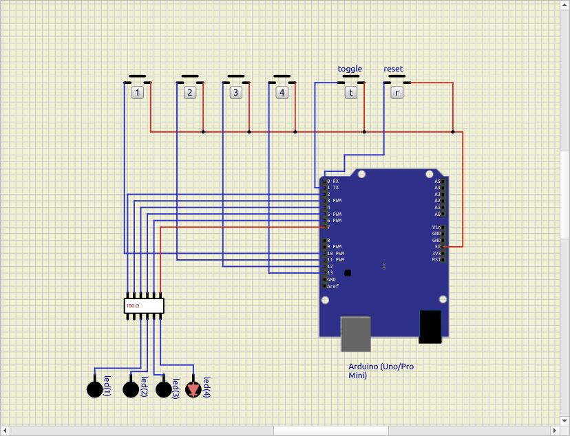
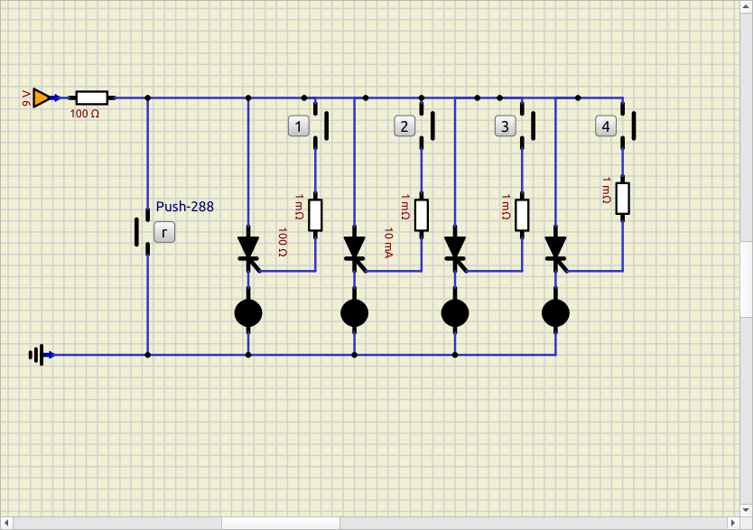
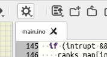
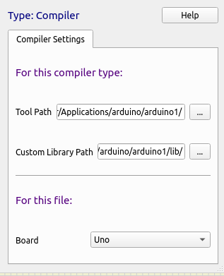

# QUIZ Hardware
Hardware setups for quiz programs.
### IC based

### Non Ic Based
 

# Installations
- [SimulIDE](https://simulide.com/p/downloads/): Last Stable Version (1.1.0)
- [Arduino](https://www.arduino.cc/en/software/#legacy-ide-18x): Legacy IDE (1.8.X). We need the Legacy IDE, as SimulIDE only support older versions

# Setting Up SimulIDE with Arduino 
> credits to [pcotret](https://github.com/pcotret/), for amazing [guide](https://pcotret.github.io/simulide/) on this 
- load an arduino from `Components>Micro>Arduino`
- now creat new `.ino` file on the code editor at left side
    or click on `📁+` icon 
- after the file is created, click on gear icon, just above the 
  file name you just created 
- and now click on `compiler setting`
- and in `Tool Path` choose the folder, where the `arduino-builder` executable is located 
      
      not the `arduino-builder` is located inside the folder where
        you unziped/installed the Arduino, pick the folder not the actual executable
- [Optionally] If you are trying to use, external libaries or tools
  then in, the `Custom Libary Path` select the path to the libary  
- now you can compile and run, normally

# Running the project(IC based)
- open the `quiz_hardware.sim1` in SimulIDE
- and open the `main.ino` in code editor
- now you can compile and run, the project
  > you have click on loadfirmware icon, only compiling dosenot
  > do the job, so directly click on loadfirmware, this will do compilation and other part
 
# Running the project (Non Ic based)
- open the `no_ic_quiz.sim1` in SimulIDE
- and start simulation

 # Total Hardware Cost Analysis for IC based

 | Item                                   | Qty             | Unit Price (NPR) | Total (NPR) | Purchase Link                                                                                                                                |
| -------------------------------------- | --------------- | ---------------- | ----------: | -------------------------------------------------------------------------------------------------------------------------------------------- |
| **Arduino Pro Mini (5V/16MHz)**        | 1               | 599              |         599 | [Daraz Nepal](https://www.daraz.com.np/products/arduino-pro-mini1-pcs-i129909126.html)                                                       |
| **Push Buttons (30 mm, mixed colors)** | 4               | 254 *each*       |       1,016 | [Daraz: 10-pack](https://www.daraz.com.np/products/30mm-10-color-push-button-for-arcade-game-joystick-controller-mame-i135223654.html)       |
| **Panel LED (8 mm, RGBY)**             | 4               | 170 *each*       |         680 | [RoboNepal (8mm LED)](https://robonepal.com/product/red-10-24v-8mm-led-metal-indicator-light/)                                               |
| **Resistors (220 Ω, 0.25W)**           | 1 (pack of 100) | 90               |          90 | [RoboNepal (220Ω×100)](http://robonepal.com/product/220-ohm-0-25w-metal-film-resistor-pack-of-100-2/)                                        |
| **Jumper wires (40-pin M–M)**          | 1 pack (40)     | 150              |         150 | [RoboNepal (40-pin cable)](https://robonepal.com/product/male-to-male-jumper-wires-40-pin-30cm/)                                             |
| **Breadboard (830-point)**             | 1               | 258              |         258 | [RoboNepal (830pt board)](https://robonepal.com/product/transparent-830-points-solderless-breadboard/)                                       |
| **USB–TTL Adapter (CP2102)**           | 1               | 358              |         358 | [RoboNepal (CP2102 module)](https://robonepal.com/product/cp2102-micro-usb-to-uart-ttl-module-6pin-serial-converter-uart-stc-replace-ft232/) |
| **USB Cable (Micro USB)**              | 1               | 199              |         199 | [Daraz (Type-B cable)](https://www.daraz.com.np/products/fast-charging-micro-usb-cable-type-b-i121880166.html)                               |
| **Total**                              | —               | —                |   **3,350** | —                                                                                                                                            |

 # Total Hardware Cost Analysis for non-IC based

 | Component                 | Quantity | Price (NPR) | Source                                                                                                                    |
| ------------------------- | -------- | ----------- | ------------------------------------------------------------------------------------------------------------------------- |
| **0.1-10M Ω Resistor**         | N pcs    | ₨ 4.00 per piece    | [Giga Nepal](https://www.giganepal.com/product/resistance-0-5w-0-1-10m-ohm-carbon-film-resistor/?v=584a79c5e916) |
| **Push Button Switch**    | N pcs    | ₨ 10.00 per piece    | [Giga Nepal](https://www.giganepal.com/product/push-switch-long-head-4-pin/?v=584a79c5e916)        |
| **LED (Assorted Colors)** | N pcs    | ₨ 300.00 per 60 (6 colored) pieces     | [Giga Nepal](https://www.giganepal.com/product/5mm-led-diffused-assorted-colors-10-pcs/)                                  |
| **LED (White Base Bright)** | N pcs    | ₨ 135.00 per 10 pcs     | [Giga Nepal](https://www.giganepal.com/product/3-volt-led-1-w-10-pcs/?v=584a79c5e916)                                  |
| **Thyristor (MAC223-6)**  | N pcs     | ₨ 250.00   per piece  | [Giga Nepal](https://www.giganepal.com/product/motorola-triac-silicon-bidirectional-triode-thyristors-25a-400v-mac223-6/) |
| **Li-ion Battery** | X pcs | Rs 150-250 per pieces | [Giga Nepal](https://www.giganepal.com/categories/battery-battery-chargers-nepal/rechargeable-lithium-ion-batteries-nepal/?v=584a79c5e916)
| **Total Cost: for 4 players**| (4+10+10+250+200) * 4 | = **~2,000**NPRS